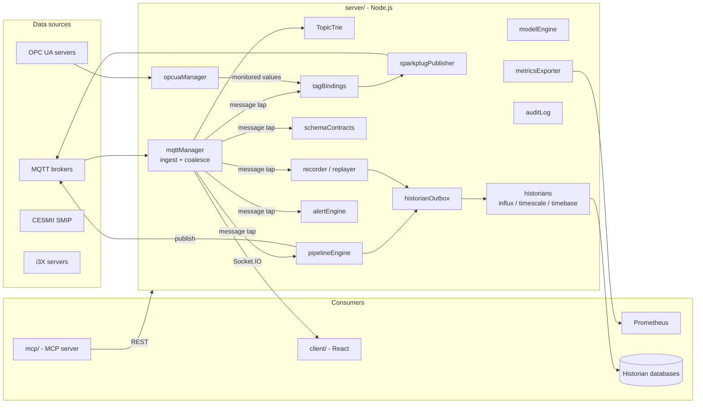
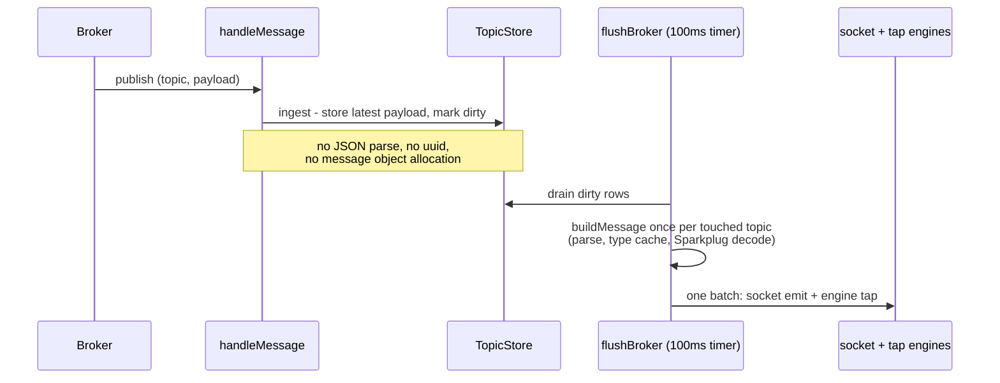
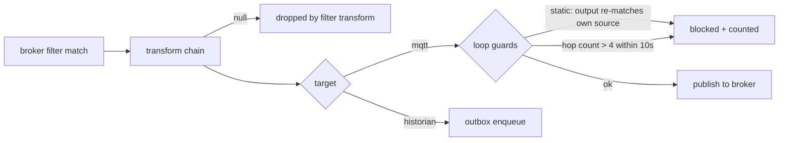
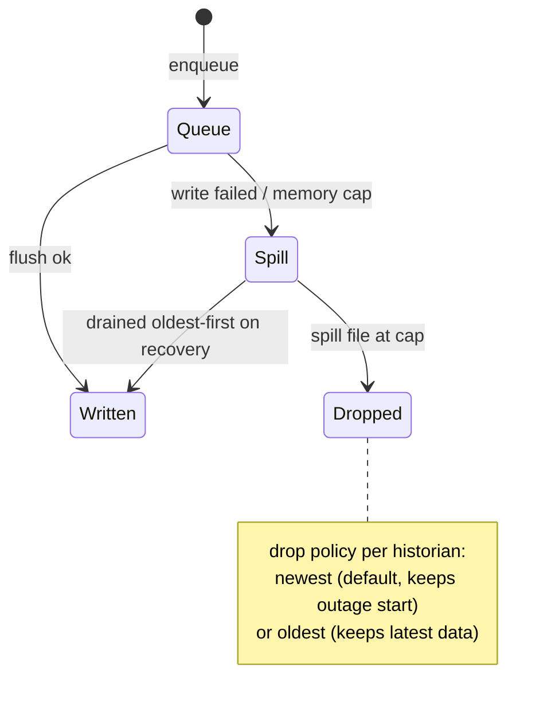
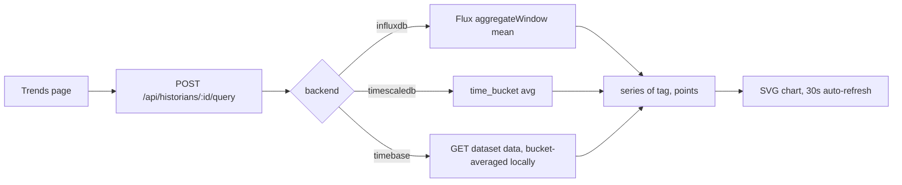
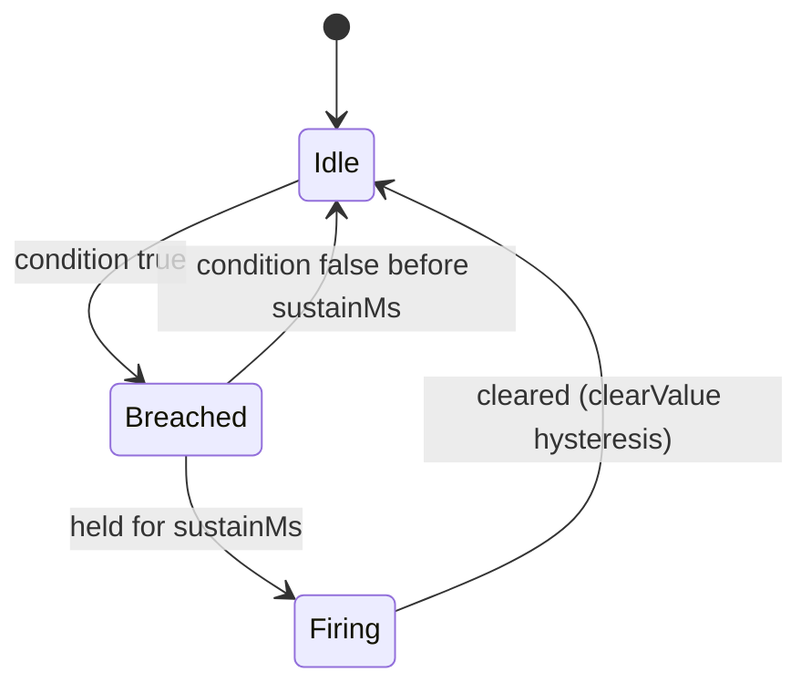
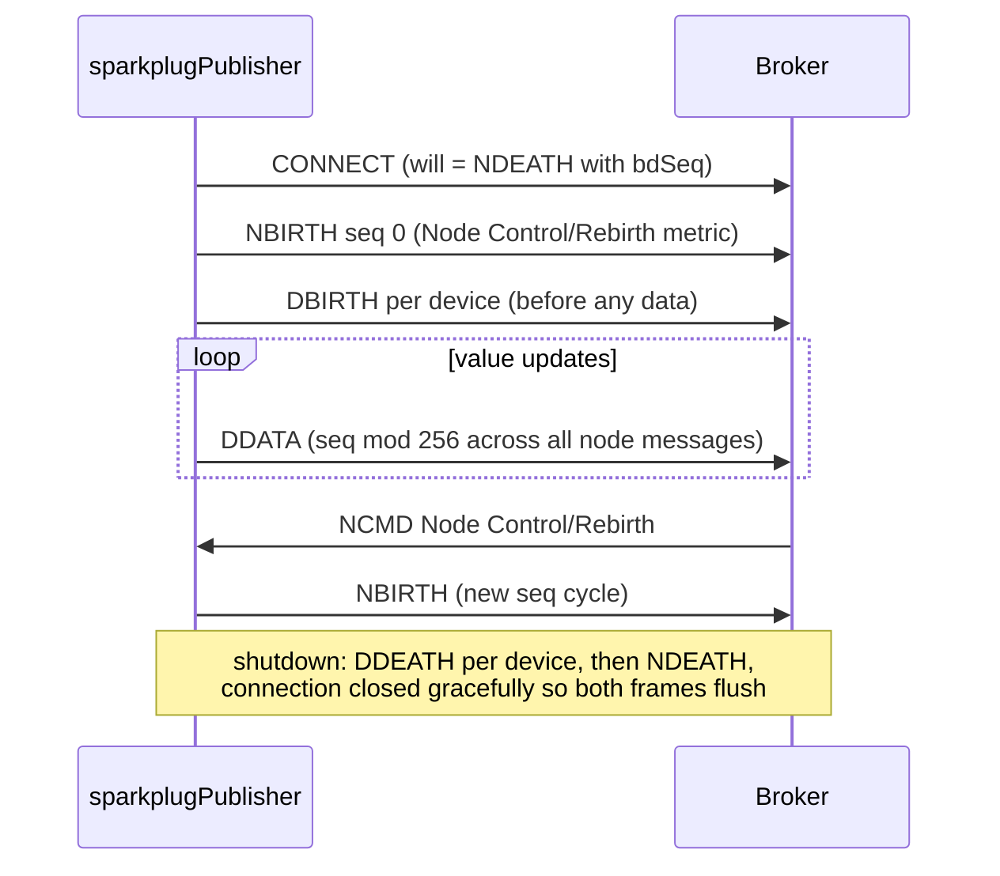
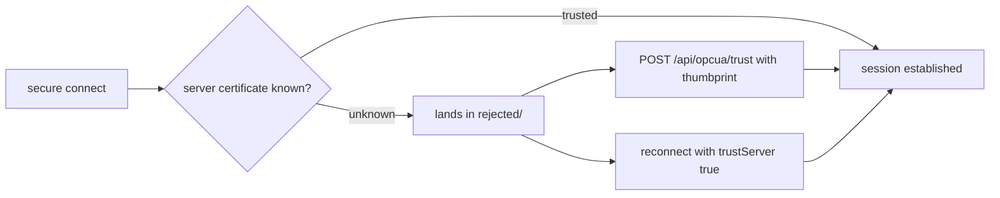

# Manifold architecture

This document describes how Manifold is built: the system layout, the message
hot path, each subsystem, the API surface, protocol behavior worth knowing,
and the testing strategy. The README stays short; the details live here.

## System overview



The backend owns all live state. The client is a real-time view over
Socket.IO plus REST for configuration. The MCP server is a stateless bridge
over the same REST API, so a browser user and an MCP agent see identical
data.

## Repository layout

```
server/   Express + Socket.IO backend; all protocol drivers and engines
client/   React 18 + Vite + Tailwind; canvas renderers, Zustand store
mcp/      MCP server (stdio), forwards to the backend REST API
native/   Rust/napi hot-path experiment, kept as a reproducible benchmark
docker/   Demo stack: app, mosquitto, OPC PLC simulator, traffic generator
```

## Message hot path

The server is built to survive high publish rates. The design rule: per-message
work is minimal and allocation-free; everything expensive is deferred to a
coalced flush that is bounded by *topics touched*, not messages received.



Key mechanics:

- **TopicStore** (`server/services/topicStore.js`) is a struct-of-arrays: one
  `Map(topic → slot)` plus parallel typed arrays, with the latest payload kept
  as a latin1 string (one byte per char in V8, lossless for arbitrary bytes).
  Capped at 2M topics per broker. At 1M topics this measured 425 MB RSS versus
  532 MB for a Map-of-objects; the Rust store measured 380 MB but lost on
  FFI round-trip cost (see `native/README.md` for the full benchmark).
- **Coalescing**: a topic published 10,000 times inside one 100 ms window
  produces one forwarded update. Per-flush forwarding is capped
  (`FORWARD_CAP`), with counts always exact server-side.
- **Per-slot type cache**: a topic's classification (telemetry/alarm/…,
  Sparkplug or not) is a pure function of the topic string, so it is computed
  once per slot, not per flush.
- **Single topic split**: the flush splits each topic once and passes
  `topicParts` to every tap consumer (pipelines, recorder, contracts,
  bindings).
- **Zero-listener guard**: the socket batch is not serialized when no client
  is connected (headless or MCP-only deployments).
- Intake subscribes at QoS 1 by default (configurable per broker). If the
  broker refuses the wildcard grant (SUBACK 0x80), the manager emits
  `subscription-downgraded` and retries at QoS 0. `$SYS/#` stays at QoS 0.

## MQTT transports and versions

A broker connection is `mqtt`, `mqtts`, `ws`, or `wss`. WebSocket transports
require an explicit path (`wsPath`, default `/mqtt`) because there is no
universal convention (Mosquitto listens on 9001, reverse proxies on 443).

`mqttVersion` is 4 (MQTT 3.1.1, default) or 5 per broker. On v5 sessions,
inbound user properties, content type, response topic, and correlation data
are decoded onto the message (correlation data as base64), and the publish
API takes `properties` (`userProperties`, `contentType`, `responseTopic`) on
`POST /publish`. Properties are silently dropped on v4 sessions — mqtt.js
errors if they are sent there.

The intake subscription itself is configurable per broker (`subscribeFilter`,
default `#`), including shared subscriptions: `$share/<group>/<filter>` works
unchanged because messages still arrive on the real topic, so nothing
downstream cares. Use it to split intake load across multiple Manifold
instances or to scope intake to a namespace.

## Wildcard resolution

A subscription filter is a query, not a destination. `TopicTrie` indexes every
observed topic; filters (`+`, `#`, `$share` groups, `$`-topic exclusion rules)
resolve to exact match counts, covering subtree roots, and concrete leaf
topics. The trie builds lazily on first resolve and indexes incrementally
afterward. Flows uses this to show what each consumer actually receives;
pipeline previews and alert rules run on the same index.

## UNS derivation

The UNS view is derived entirely from observed traffic — there is no separate
registration step. The client keeps per-path activity, value, and rate maps
fed by the message stream, aggregated up the ancestor chain. Staleness is
per-topic: an EMA of inter-arrival gaps means a topic publishing every 500 ms
is flagged *overdue* seconds after it stops, while a daily report topic is not
flagged for hours. Server-side, `getUnsTree` returns a depth- and node-capped
skeleton with exact subtree counts, and the lint pass scores structural
conformance (naming-convention mixes, payloads on branches, empty segments,
single-child chains, depth variance).

The topology canvas throttles its draw loop to roughly 8 fps when there is no
traffic and no interaction, returning to full frame rate on either signal.

## Pipelines



- The route table is **compiled**: filters pre-split, disabled routes
  excluded, rebuilt only when the profile store revision changes. Steady-state
  per-message cost is array walks against pre-split segments.
- Transforms: `repath` (with `{n}` / `{n-}` / `{topic}` segment templates),
  `pick`, `rename`, `set`, `scale`, `numeric` (drop non-numeric), `sparkplugFlatten`
  (`is_null` metrics propagate as explicit nulls), `envelope` (TVQ `{v,t,q}`).
- Loop protection is two-layer because repath templates defeat static
  analysis: outputs matching the route's own source are blocked outright, and
  a short-lived hop counter on published (broker, topic) pairs catches
  indirect A→B→A cycles across routes and brokers.
- Every route can be dry-run against the observed topic set before enabling:
  the trie resolves the source filter, each sample's latest payload runs
  through the transform chain, and the in→out mapping is reported without
  publishing.

## Historians and store-and-forward

Three backends share one write interface (`writePoints`):

| Backend | Wire format | Notes |
|---|---|---|
| InfluxDB v2 | line protocol | numeric values write `value=`, non-numeric write `raw="…"` — a topic that alternates types cannot cause field-type conflicts in a shard |
| TimescaleDB / PostgreSQL | batched parameterized INSERT | table auto-created, promoted to hypertable when the extension exists; identifier allow-list; pooled connections with bounded connect/query timeouts |
| Timebase (Flow Software) | TVQ REST on `:4511` | datasets auto-create; write path overridable per instance; Timebase's native MQTT/Sparkplug ingestion is an equally valid path |

Delivery always goes through the **outbox** — engines never call a historian
directly:



The spill is an append-only JSONL file per historian that survives restarts.
All bounds are explicit and reported (queue depth, spill bytes, drop counts)
in the UI and `/metrics`.

### Read-back (Trends)

The write path has a read counterpart: `queryTags` lists distinct stored
topics and `querySeries` reads downsampled series for up to 10 tags over a
time range (`GET /api/historians/:id/tags`, `POST /api/historians/:id/query`).



- Downsampling happens in the database: the requested range is bucketed to at
  most `maxPoints` (default 1000) buckets, so a month of 1 Hz data comes back
  as ~1000 averaged points, not 2.6M rows.
- Flux has no parameter binding over the raw `/query` endpoint, so tag names
  are strictly validated and quoted rather than interpolated cleverly;
  TimescaleDB queries are parameterized.
- Timebase read-back uses the same documented dataset GET the CI integration
  test exercises; the API returns raw TVQs, so downsampling happens locally.
  Tag listing has no Timebase endpoint — Trends falls back to manual entry.

## Alerting

Four rule types share one engine (`server/services/alertEngine.js`), with two
evaluation paths:

- **Silence and appearance rules** (`branch-silent`, `topic-silent`,
  `new-topic`) evaluate on a 15 s interval against the topic index.
- **Value rules** (`value-threshold`) ride the live message tap: a dot-path
  `field` into the JSON payload (or the payload itself) is compared against
  `value` with one of `>`, `>=`, `<`, `<=`, `==`, `!=` — at message latency,
  not poll latency. The rule table is compiled (filters and field paths
  pre-split, disabled rules excluded, rebuilt only on profile revision
  change — the same pattern as the pipeline engine), so steady-state
  per-message cost is an integer compare plus array walks.

Value-rule state machine:



`sustainMs` requires the condition to hold continuously before firing;
`clearValue` adds hysteresis (a `>` rule resolves only at
`value <= clearValue`, a `<` rule only at `value >= clearValue`) so a signal
hovering at the threshold cannot flap. Non-numeric payloads are ignored, not
errors.

Rules fire on transitions and can POST each event to a webhook (5 s timeout).
Webhook failures do not kill the engine, but they are not silent either:
`webhookFailures` and `lastWebhookError` are reported on
`GET /api/alerts/rules`.

## Tag bindings and the Sparkplug publisher

Bindings select tags from a source (OPC UA monitored items or Sparkplug
registry metrics; MQTT-source selections compile into pipeline routes
instead) and publish to a UNS destination. Report-by-exception: an absolute
deadband suppresses small numeric changes; non-numeric values publish on
change. OPC UA status codes map to quality (Good 192 / Uncertain 64 / Bad 0).
Bindings never write toward devices.

Sparkplug output runs one session per (broker, group, edge node) with the
lifecycle the specification requires:



### Sparkplug host application STATE

The registry also folds `spBv1.0/STATE/{host}` messages: each host
application's online/offline status (JSON `{online, timestamp}` per Sparkplug
3.0, with legacy `ONLINE`/`OFFLINE` strings accepted) is tracked, shown in the
UI, and emitted as `host-online` / `host-offline` events. STATE is retained,
so a new subscriber replays the current status immediately.

Manifold can act as a primary host itself: `POST /api/tags/sparkplug/state`
starts a dedicated session that publishes retained STATE for a chosen host ID
with a matching last-will, so edge nodes waiting on a primary host see one.

## OPC UA security

OPC UA connections accept `securityMode` (`None`, `Sign`, `SignAndEncrypt`)
and `securityPolicy`. Secure modes run through a shared application PKI
rooted at `<MANIFOLD_DATA_DIR|server/data>/pki` in the standard node-opcua
layout:

```
pki/
  own/certs/client_certificate.pem   Manifold's application certificate
  own/private/                       private key
  trusted/certs/                     server certificates we accept
  rejected/                          server certificates seen but not trusted
  issuers/                           CA material
```

The self-signed application certificate is created on first use; the URI
baked into it must match the client's application URI (node-opcua checks the
two on every secure connect). `GET /api/opcua/certificate` returns it in PEM
form so it can be trusted on the server side.

Trust is explicit in both directions:



Unknown server certificates are never auto-accepted: they land in
`rejected/`, listed by `GET /api/opcua/trust`, and are promoted by thumbprint
(`POST /api/opcua/trust`) or by an explicit trust-on-first-connect flag on
the connection. A trust failure produces an actionable error naming both
paths instead of a bare `BadSecurityChecksFailed`.

`POST /api/opcua/discover` asks an endpoint URL for its available endpoints
(security mode/policy combinations), so the right mode can be picked before
connecting. After any reconnect, the subscription and every monitored item
are rebuilt from the recorded (nodeId, samplingInterval) pairs — the UI never
shows a live-looking value that stopped updating.

## Client graph stack

All graph rendering and layout is client-side; the server ships data, not
coordinates.

- **Force layout** runs d3-force in a Web Worker
  (`client/src/graph/forceLayoutWorker.js`, 30k-node cap) so layout ticks
  never block the UI thread.
- **3D** (`ForceGraph3D.jsx`) is real three.js: nodes are one `InstancedMesh`
  of low-poly spheres, smooth at 50k nodes, with analytic ray-sphere picking
  instead of triangle raycasting. three.js is a lazy chunk loaded only when
  the 3D view opens.
- **WebGL 2D** remains the renderer for very large namespaces (60k+ topics).
- **Icons**: the UNS topology uses a curated ~130-icon industrial subset
  imported individually from lucide (tree-shaken; the full ~2,000-icon
  library stays out of the main bundle and loads on demand in the picker).
  User-defined single-path SVG icons are stored server-side
  (`/api/uns/icons`) and resolve like built-ins.

## Security model

- `MANIFOLD_AUTH_TOKEN` (admin) and optional `MANIFOLD_VIEWER_TOKEN` (read-only) gate the
  REST API and the socket handshake. Viewer tokens can read everything but
  every mutation — HTTP or socket — is refused.
- `MANIFOLD_TOKENS` (`name:token:role,…`) issues named tokens with per-token
  audit identity — revoke one person's token without rotating everyone's.
- Failed authentication is rate-limited per IP (20 failures/minute, then
  429), so the bearer token cannot be brute-forced quietly.
- CORS is locked to `CLIENT_URL` (default `http://localhost:3000`); a blanket
  `cors()` would let any website script an authenticated browser.
- Outbound HTTP (historian writes/queries, alert webhooks, broker admin APIs)
  goes through bounded timeouts (`services/httpTimeout.js`) — a hung remote
  endpoint cannot pin a request handler forever.
- Every mutating action lands in the audit log (role, IP, route, outcome)
  with secrets redacted, kept in a ring buffer and an append-only JSONL file.
- Secrets (broker passwords, historian tokens, admin API keys) are stored
  server-side only: never echoed by the API, redacted from audit entries, and
  stripped from config exports. Config import preserves stored secrets when
  the incoming document omits them.
- `server/data/` is written mode 0600/0700. It is not encrypted: without a
  real key-management story, at-rest encryption of a file the server must
  read on boot adds no protection, so the honest measure is file permissions
  plus host security.

## Protocol notes

Observed behavior that shapes the implementation:

- **EMQX default ACL and QoS 1 wildcards.** Stock EMQX denies `#`
  subscriptions at QoS 1+ from non-localhost clients, and its default
  `deny_action = ignore` makes the denial silent: the SUBACK reports success
  and the subscription simply never exists. No client-side logic can detect
  this. The QoS-0 fallback covers brokers that refuse loudly per spec;
  for EMQX, either grant the permission in the broker ACL or configure
  intake at QoS 0. CI's EMQX container authorizes wildcard intake the way a
  production deployment backing a UNS platform would.
- **Mosquitto has no per-client subscription API.** `mosquitto_ctrl` manages
  accounts and ACLs, not live subscriptions, so consumer resolution against
  mosquitto is limited to observed traffic. The UI states this rather than
  implying MQTT exposes more than it does.
- **Sparkplug edge death cascades to devices**, per specification, and the
  registry applies this when an NDEATH arrives.
- **InfluxDB field types are fixed per shard.** The first write wins; later
  writes with a different type are rejected. Splitting numeric (`value=`) and
  string (`raw=`) fields at the client makes this failure mode impossible.
- **pg defaults block forever.** `connectionTimeoutMillis` defaults to 0; an
  unreachable database turns into a hung process rather than an error. All
  pools set bounded connect/query timeouts and `allowExitOnIdle`.

## HTTP API

| Method | Path | Description |
| --- | --- | --- |
| `GET` | `/api/system/status` | Overall status |
| `POST` | `/api/system/discovery/start` | Start a network scan |
| `GET/POST` | `/api/mqtt/brokers` | List / connect brokers |
| `PUT/DELETE` | `/api/mqtt/brokers/:id` | Edit in place (reconnects); disconnect |
| `GET` | `/api/mqtt/brokers/:id/topics` · `/messages` | Topic list; recent messages |
| `POST` | `/api/mqtt/brokers/:id/publish` | Publish (MQTT 5 `properties` on v5 sessions) |
| `GET` | `/api/mqtt/brokers/:id/sparkplug` · `/sys` | Sparkplug topology; `$SYS` summary |
| `POST` | `/api/mqtt/brokers/:id/subscriptions/resolve` | Resolve wildcard filters against observed topics |
| `GET` | `/api/mqtt/brokers/:id/topictree` | One tree level with subtree counts |
| `GET` | `/api/mqtt/brokers/:id/admin/pubsub` | Per-client subscriptions from the broker admin API |
| `GET` | `/api/mqtt/brokers/:id/uns/tree` · `/uns/lint` · `/uns/events` | UNS skeleton, lint report, event feed |
| `GET/POST/DELETE` | `/api/uns/mounts` | Mount OPC UA / i3X sources into the UNS |
| `GET/POST/DELETE` | `/api/uns/icons` | Custom UNS icons (single-path SVG, upsert by name) |
| `GET/POST/DELETE` | `/api/alerts/rules` · `GET /api/alerts/events` | Alert rules (upsert by id); recent firings |
| `GET/POST/DELETE` | `/api/pipelines` · `POST /preview` | Routes (upsert by id); dry-run |
| `GET/POST/DELETE` | `/api/historians` · `POST /:id/test` | Historian connections (upsert by id); test write |
| `GET/POST` | `/api/historians/:id/tags` · `/query` | Read-back: stored tags; downsampled series |
| `GET/POST/DELETE` | `/api/models` | Contextualization models |
| `GET/POST/DELETE` | `/api/recorder` · `GET /:id/data` · `POST/DELETE /replay` | Recording; read-back; replay |
| `GET/POST/DELETE` | `/api/contracts` · `/infer` · `/violations` | Schema contracts |
| `GET` | `/api/tags/sources` · `/browse` | Tag browser |
| `GET/POST/DELETE` | `/api/tags/bindings` | Tag bindings |
| `POST` | `/api/tags/sparkplug/state` | Start/stop a Sparkplug host STATE session |
| `GET` | `/api/audit` | Audit trail (admin only) |
| `GET/POST` | `/api/system/config/export` · `/import` | Config as code |
| `GET` | `/metrics` | Prometheus metrics |
| `POST` | `/api/opcua/connections` · `/:id/monitor` | OPC UA connect; monitor |
| `PUT/DELETE` | `/api/opcua/connections/:id` | Edit in place (reconnects); disconnect |
| `GET` | `/api/opcua/connections/:id/browse` | Browse the address space |
| `POST` | `/api/opcua/discover` | Endpoint discovery (security modes/policies) |
| `GET` | `/api/opcua/certificate` | Manifold's application certificate (PEM) |
| `GET/POST` | `/api/opcua/trust` | List trusted/rejected certs; trust by thumbprint |
| `POST` | `/api/cesmii/config` · `/history` | CESMII configure; time-series |
| `POST` | `/api/i3x/connect` · `/probe` · `/value` · `/history` | i3X connect/probe; reads |
| `GET` | `/api/i3x/objects` · `/graph` · `/namespaces` | i3X inventory |

Live updates (messages, broker stats, engine metrics, alerts, OPC UA values,
discovery progress) stream over Socket.IO. Engine metrics push every 2 s only
while a client is connected.

## MCP tools

75 tools, covering reads and mutations across the whole backend. Mutating
tools say so in their descriptions, and every call goes through the same
authenticated REST API (and therefore the same audit log) as the UI.

| Group | Tools |
| --- | --- |
| System & config | `system_status` · `discover_scan` · `discover_results` · `discovery_stop` · `config_export` · `config_import` |
| MQTT | `mqtt_list_brokers` · `mqtt_connect` · `mqtt_disconnect` · `mqtt_list_topics` · `mqtt_get_messages` · `mqtt_sparkplug_topology` · `mqtt_sys_stats` · `mqtt_resolve_subscriptions` · `mqtt_topic_tree` · `mqtt_admin_pubsub` · `mqtt_subscribe` · `mqtt_publish` |
| UNS | `uns_tree` · `uns_lint` · `uns_events` · `mount_save` · `mount_delete` |
| Pipelines | `pipelines_list` · `pipeline_preview` · `pipeline_save` · `pipeline_delete` |
| Historians | `historians_list` · `historian_save` · `historian_delete` · `historian_test` |
| Contracts | `contracts_list` · `contract_infer` · `contract_lock` · `contract_delete` · `contracts_violations` |
| Models | `models_list` · `model_save` · `model_delete` |
| Tags & bindings | `tags_sources` · `tags_browse` · `bindings_list` · `binding_save` · `binding_delete` |
| Recorder & replay | `recorder_list` · `recorder_save` · `recorder_delete` · `recorder_data` · `replay_start` · `replay_stop` |
| Alerts & audit | `alert_rule_save` · `alert_rule_delete` · `alert_events` · `audit_recent` |
| OPC UA | `opcua_list_connections` · `opcua_connect` · `opcua_disconnect` · `opcua_browse` · `opcua_read` · `opcua_monitor` |
| CESMII SMIP | `cesmii_status` · `cesmii_configure` · `cesmii_list_equipment` · `cesmii_list_attributes` · `cesmii_history` · `cesmii_query` |
| i3X | `i3x_status` · `i3x_connect` · `i3x_probe` · `i3x_namespaces` · `i3x_object_types` · `i3x_graph` · `i3x_related` · `i3x_value` · `i3x_history` |

## Testing

Server tests (`cd server && npm test`) run on `node:test` through a
small serial runner (`server/test/run.js`) that executes each file
in-process. The stock `node --test` runner spawns each file as a child and
streams results over an IPC pipe whose framing corrupts intermittently on CI
runners ("Unable to deserialize cloned data") — observed on Node 20 and 22,
including at concurrency 1. Direct execution produces the same TAP output and
exit semantics with no IPC.

Coverage highlights:

- Topic trie wildcard semantics, UNS lint and feeds, alert transitions,
  history snapshot/restore, auth/RBAC boots with audit and `/metrics`.
- DataOps: every transform, both loop guards (including an A→B→A ping-pong),
  outbox spill/drain across a simulated restart, both drop policies verified
  byte-for-byte on the spill file, every historian wire format (write and
  read-back) against fakes (including an identifier-injection refusal for
  TimescaleDB).
- OPC UA security: PKI bootstrap (application certificate generation), the
  trust API, and promotion of rejected certificates to trusted.
- Subscription-refusal fallback against a fake client reproducing mqtt.js's
  error-form SUBACK.
- Real-broker integration via in-process aedes: manager round-trip, a
  pipeline end-to-end, and the full Sparkplug NBIRTH → DBIRTH → DDATA →
  DDEATH/NDEATH lifecycle with sequence assertions, witnessed by an
  independent client.
- Perf smoke: order-of-magnitude floors on 200k ingests, trie build/resolve,
  and 50k tapped messages across 20 compiled routes.

Client tests (Vitest) cover the pure logic modules: topic-filter matching,
graph builders/collapse/coverage, UNS tree building, payload diff.

CI (`.github/workflows/ci.yml`) runs four jobs on every push and PR: server
tests (Node 22), client tests + production build, an MCP load check, and an
integration job against real service containers — EMQX 5 (configured to
authorize wildcard QoS-1 intake), InfluxDB 2 (line-protocol writes queried
back via Flux), TimescaleDB (rows queried back out of a hypertable), and a
Timebase historian. Version tags (`v*`) additionally build and publish the
`ghcr.io/zbest1000/manifold` image.
Jobs carry 15-minute timeouts, the service-wait step fails by name instead of
passing through a dead container, failures dump container logs, and a
concurrency group cancels superseded runs.

## Performance notes

The pure-JS hot path sustains ~4M messages/s ingest on commodity hardware. A
Rust/napi implementation of the same store was benchmarked (`native/`):
Rust wins when Rust owns the loop (12M/s) but loses through per-message or
batched FFI (2.8M/s and 1.4M/s) — the napi boundary costs more than the work
it saves. The struct-of-arrays JS store also recovered most of Rust's memory
advantage (425 MB vs 380 MB at 1M topics). The addon is kept as a
reproducible benchmark, not a dependency.
