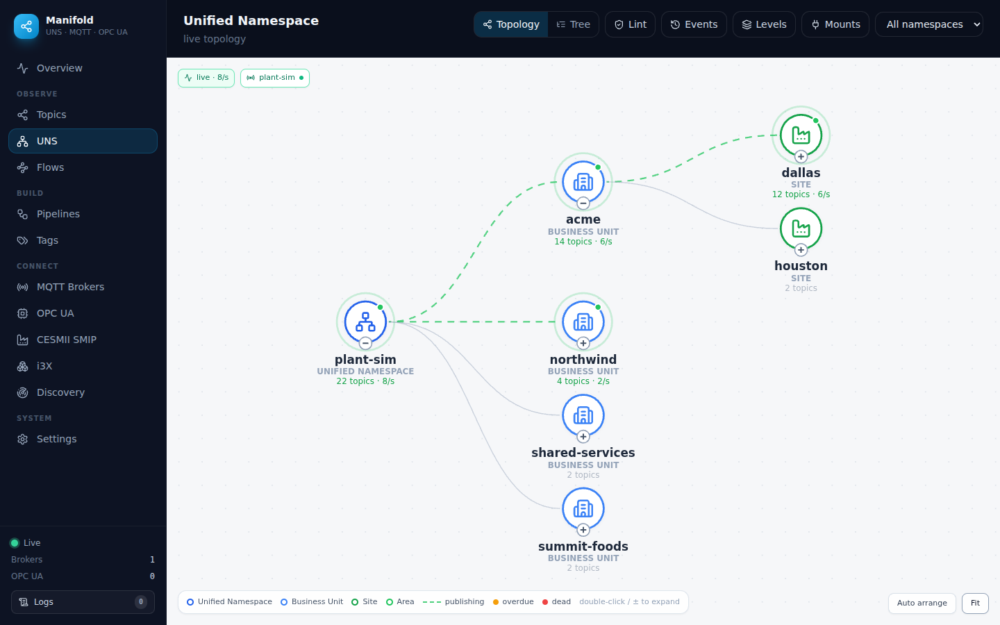

# Manifold

[](https://github.com/zbest1000/manifold/actions/workflows/ci.yml)
[](#license)
[](https://nodejs.org)

Industrial data explorer and DataOps toolkit: MQTT, Sparkplug B, OPC UA, CESMII SMIP, and i3X, with a live Unified Namespace view.

**[Website](https://zbest1000.github.io/manifold/)** · **[Docs / Wiki](../../wiki)** · **[Architecture](ARCHITECTURE.md)** · **[Changelog](CHANGELOG.md)**

<p align="center">
  
</p>

Manifold connects to brokers and servers, streams their data in real time, and renders it as a live UNS topology, interactive topic/address-space graphs, and producer → topic → consumer lineage. A DataOps layer routes and reshapes the stream: pipelines, contextualization models, historian delivery with store-and-forward, recording/replay, schema contracts, and tag bindings with a Sparkplug B publisher. An included MCP server exposes the same backend to AI agents.

## Features

**Explore**
- MQTT topic tree, 2D/3D graphs, and a WebGL renderer for very large namespaces (60k+ topics). JSON, text, binary, and Sparkplug B payloads decoded. The 3D view is real three.js instancing (50k nodes); force layout runs in a Web Worker.
- MQTT 3.1.1 and 5 (per broker), over `mqtt`/`mqtts`/`ws`/`wss`, with a configurable intake filter including `$share` shared subscriptions. MQTT 5 user properties, content type, response topic, and correlation data decoded on messages; the first three publishable.
- OPC UA address-space browsing with live monitored values; secure connections (Sign / SignAndEncrypt) with endpoint discovery and a built-in certificate trust store.
- Producer/consumer lineage: Sparkplug topology from BIRTH/DEATH certificates (including host application STATE), per-client subscriptions from broker admin APIs (EMQX, HiveMQ), wildcard filters resolved against observed topics.
- Network discovery by CIDR scan with protocol handshake verification.
- Message history survives restarts; any two payloads can be diffed structurally.

**Unified Namespace**
- Live ISA-95 topology built from observed traffic: values on leaves, per-branch message rates, publishing edges animated.
- Per-topic staleness calibrated to each topic's own publish cadence.
- Namespace lint (0–100 score with structural findings), event feed (new topics, Sparkplug lifecycle), editable level ladder, and mounts for OPC UA / i3X sources.
- Curated industrial icon set (~130 icons) with automatic mapping, plus user-defined custom SVG icons.

**DataOps**
- Pipelines: filter → transform chain (repath, pick/rename/set, scale, numeric, Sparkplug flatten, TVQ envelope) → broker or historian, with a dry-run preview against live topics and two-layer loop protection.
- Models: merge fields from many topics into one object at a clean UNS path.
- Historians: InfluxDB v2, TimescaleDB/PostgreSQL, and Timebase (Flow Software) — all through a store-and-forward outbox with disk spill and configurable drop policy.
- Trends: chart stored series from InfluxDB and TimescaleDB — or a local file **recording**, with no external database — up to 10 tags per chart, downsampled server-side, auto-refreshing.
- Recorder and replay, schema contracts with drift detection, alert rules with webhooks — silence/new-topic rules plus value thresholds with sustain and hysteresis, evaluated at message latency.
- Everything edits in place: brokers, OPC UA connections, pipelines, historians, models, bindings, and alert rules update without delete/re-add.

**Tags**
- Unified tag browser (OPC UA, Sparkplug registry, MQTT trie) with CSV import.
- Bindings publish device tags into the UNS as plain values, TVQ envelopes, or a Sparkplug B device, with deadband and quality mapping. Read-only toward devices.
- Optional Sparkplug primary-host session: Manifold publishes retained `STATE` so edge nodes see a host application.

**Operations**
- Token auth with admin and read-only roles (including named, individually revocable tokens), enforced identically on the REST API and the Socket.IO handshake, with per-IP auth-failure rate limiting on both. Audit log, config export/import with secrets stripped.
- Fail-closed by default: with no token the server binds `127.0.0.1` only. An egress guard blocks the network scanner and outbound HTTP clients from reaching loopback, cloud-metadata, and (unless opted in) private ranges. Security headers (`helmet`) and a general request rate limit are on by default.
- Self-observability: a **System (Health)** page renders Manifold's own Prometheus `/metrics` live — process health, per-broker ingest, and every engine counter, each with a rolling sparkline.

See [ARCHITECTURE.md](ARCHITECTURE.md) for how it works: system design, the message hot path, the API surface, protocol notes, and testing. Operational guides (broker ACLs, historian setup, transform reference, troubleshooting) live in the [wiki](../../wiki), generated from [`docs/wiki/`](docs/wiki). Release history is in [CHANGELOG.md](CHANGELOG.md); release steps and verification status are in [docs/RELEASING.md](docs/RELEASING.md).

## Quick start

Requires Node.js ≥ 20.19 (or 22+).

```bash
npm run install:all
npm run dev            # client on :3000, backend on :5000
```

Production build:

```bash
npm run build
npm start              # serves API + built client on :5000
```

## Docker

A prebuilt image serves the API and the built UI from one container (published on every `v*` tag):

```bash
docker run -p 5000:5000 -v manifold-data:/data ghcr.io/zbest1000/manifold:latest
# open http://localhost:5000
```

`/data` holds profiles, history, spill files, and the OPC UA PKI (`MANIFOLD_DATA_DIR`). Pass auth tokens as `-e` environment variables. A full demo stack (broker, OPC UA simulator, traffic generator) is one command away — see [DOCKER.md](DOCKER.md).

## Authentication

Manifold is a control plane: it can publish to brokers, send Sparkplug commands, and start network scans. Before exposing it beyond localhost, set a token:

```bash
MANIFOLD_AUTH_TOKEN=$(openssl rand -hex 24) npm start
```

With `MANIFOLD_AUTH_TOKEN` set, all API routes and the socket handshake require `Authorization: Bearer <token>`, and the UI shows an unlock screen. `MANIFOLD_VIEWER_TOKEN` adds an optional read-only role, and `MANIFOLD_TOKENS` (`name:token:role,…`) issues named, individually revocable tokens whose names appear in the audit trail. Failed authentication is rate-limited per IP (on both the REST and socket paths). Without a token the server **binds `127.0.0.1` only** and warns at startup — an unauthenticated instance is reachable off-host only if you set `MANIFOLD_HOST=0.0.0.0` deliberately.

Connection profiles persist in `server/data/profiles.json` (mode 0600; directory configurable via `MANIFOLD_DATA_DIR`, restore disabled via `MANIFOLD_NO_RESTORE=1`). The file may contain broker credentials, so protect the host.

### Environment variables

| Variable | Default | Purpose |
|----------|---------|---------|
| `MANIFOLD_AUTH_TOKEN` | _(none — open)_ | Admin bearer token; when unset the server binds loopback only |
| `MANIFOLD_VIEWER_TOKEN` | _(none)_ | Optional read-only token (GETs succeed, mutations 403) |
| `MANIFOLD_TOKENS` | _(none)_ | Named revocable tokens: `alice:secret:admin,grafana:tok:viewer` |
| `MANIFOLD_HOST` | `127.0.0.1` (open) / `0.0.0.0` (auth on) | Bind address; set to `0.0.0.0` to expose an open instance (not advised) |
| `MANIFOLD_ALLOW_PRIVATE_TARGETS` | `0` | Set to `1` to let the scanner / outbound clients reach RFC1918/LAN targets (needed for Discovery and on-prem i3X/CESMII — safe only on a trusted network). Fail-closed by default; loopback and cloud-metadata link-local are **always** blocked. The server warns at startup when this is on |
| `MANIFOLD_MAX_PAYLOAD_BYTES` | `262144` (256 KB) | Per-topic retained payload cap; larger payloads are truncated for storage/preview |
| `MANIFOLD_RATE_MAX` / `MANIFOLD_RATE_WINDOW_MS` | `600` / `60000` | General `/api` request rate limit |
| `MANIFOLD_HISTORIAN_TIMEOUT_MS` | `15000` | Deadline on historian HTTP calls |
| `CLIENT_URL` | `http://localhost:3000` | Allowed CORS origin (dev client) |
| `MANIFOLD_DATA_DIR` | `server/data` | Where profiles, history, spill files, and OPC UA PKI live |
| `MANIFOLD_NO_RESTORE` | `0` | Skip reconnecting saved profiles on startup |

## MCP server

Point any MCP client at `mcp/index.js` with the backend running:

```json
{
  "mcpServers": {
    "manifold": {
      "command": "node",
      "args": ["/absolute/path/to/mcp/index.js"],
      "env": { "MANIFOLD_API_URL": "http://localhost:5000" }
    }
  }
}
```

75 tools cover MQTT, UNS, DataOps (including saves/deletes for every engine), OPC UA, CESMII, and i3X. The full list is in [ARCHITECTURE.md](ARCHITECTURE.md#mcp-tools). Set `MANIFOLD_AUTH_TOKEN` in the MCP server's environment when the backend runs authenticated.

## Testing

```bash
cd server && npm test    # node:test, includes real-broker integration
cd client && npm test    # Vitest over the pure logic modules
```

CI additionally runs an integration job against real EMQX, InfluxDB, TimescaleDB, and Timebase containers. Details in [ARCHITECTURE.md](ARCHITECTURE.md#testing).

## License

MIT
