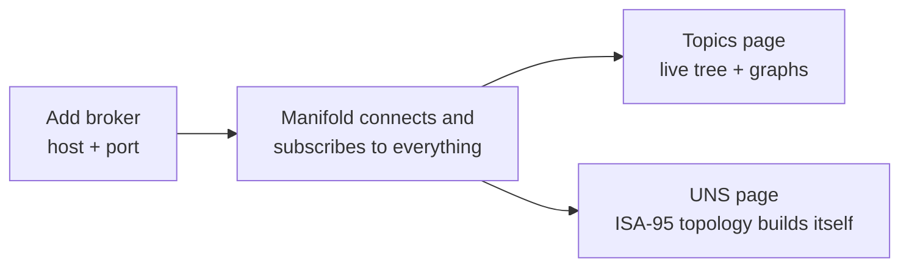

# 🏁 Getting started

> **Goal:** a running Manifold with a live broker connected, in about five minutes.

## What you need

- Node.js **≥ 20.19** (or 22+) — the OPC UA driver needs modern `require(ESM)` support.
- An MQTT broker to point at — or none at all: the Docker stack ships one with simulated traffic.

## Option A — run from source

```bash
npm run install:all
npm run dev            # client on :3000, backend on :5000 (proxied)
```

For production:

```bash
npm run build          # builds the client into client/dist
npm start              # serves API + built client on :5000
```

## Option B — Docker demo stack

One command brings up Manifold, a Mosquitto broker, an OPC UA simulator, and a
traffic generator publishing plain MQTT and Sparkplug B — pre-wired, so the UI
is alive the moment it loads:

```bash
docker compose up --build
# open http://localhost:5000
```

## Option C — prebuilt image

Just Manifold, no demo services — published to GHCR on every release:

```bash
docker run -p 5000:5000 -v manifold-data:/data ghcr.io/zbest1000/manifold:latest
# open http://localhost:5000
```

The volume at `/data` keeps profiles, history, and the OPC UA PKI across
container restarts. See [Operations](Operations) for tokens and hardening.

## Your first broker



1. Open **MQTT Brokers** → *Add broker*, enter host and port.
2. On connect, Manifold auto-subscribes to `#` (QoS 1 by default) and
   `$SYS/#` (QoS 0) — no topic list to configure.
3. Watch **Topics** fill up, then open **UNS**: the ISA-95 topology, live
   values, and per-branch rates appear with zero registration — it is all
   derived from observed traffic.


> *The connection form. Everything has a sensible default; the QoS setting is explained in [Broker Setup](Broker-Setup).*

> ⚠️ **Connected but empty on EMQX?** Stock EMQX silently refuses wildcard
> subscriptions at QoS 1. Two-minute fix in [Broker Setup](Broker-Setup).

## Environment variables

> ⚠️ **Loopback by default.** With **no** `MANIFOLD_AUTH_TOKEN` set, the server
> binds `127.0.0.1` only — it is reachable from its own host, not the network.
> This is deliberate: an unauthenticated control plane should never be exposed
> by accident. To reach it from other machines, either set a token (recommended)
> or set `MANIFOLD_HOST=0.0.0.0`. See [Operations](Operations) for the full
> hardening story.

| Variable | Purpose |
|---|---|
| `PORT` | HTTP/socket port (default 5000) |
| `MANIFOLD_AUTH_TOKEN` | Admin bearer token; enables auth on API + socket |
| `MANIFOLD_VIEWER_TOKEN` | Optional read-only token |
| `MANIFOLD_TOKENS` | Named tokens: `name:token:role,...` (roles `admin`/`viewer`) — see [Operations](Operations) |
| `MANIFOLD_HOST` | Bind address. Default `127.0.0.1` when open, `0.0.0.0` when a token is set |
| `MANIFOLD_ALLOW_PRIVATE_TARGETS` | `1` = let the scanner / outbound clients reach RFC1918/LAN targets (loopback + cloud metadata stay blocked) |
| `MANIFOLD_MAX_PAYLOAD_BYTES` | Per-topic retained payload cap (default 256 KB) |
| `MANIFOLD_DATA_DIR` | Data directory (profiles, history, outbox spill, audit, OPC UA PKI) |
| `MANIFOLD_NO_RESTORE` | `1` = don't reconnect saved profiles on boot |
| `CLIENT_URL` | Allowed CORS origin (default `http://localhost:3000`) |

## Where to next

- Wire up consumer lineage and broker health → [Broker Setup](Broker-Setup)
- Send data to a time-series database → [Historians](Historians)
- Reshape a messy namespace into a clean UNS → [Pipelines and Models](Pipelines-and-Models)
