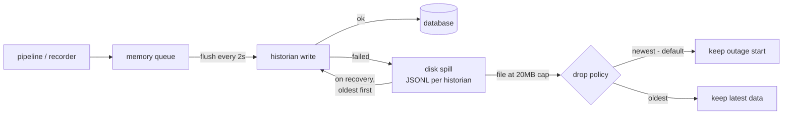

# 🗄️ Historians

> **Goal:** every sample that matters lands in a time-series database — and a
> historian outage delays data instead of deleting it.

Historians are configured under **Pipelines → Historians**. Pipelines and the
recorder never write to a database directly: everything passes through a
**store-and-forward outbox**.

> *Each historian card shows its live store-and-forward state: written, queued, spilled, dropped.*

## How store-and-forward protects your data

- The spill file survives restarts and drains **oldest-first** so ordering
  roughly holds.
- Every bound is explicit and visible — queue depth, spill bytes, and drop
  counts on the card and in `/metrics`. Nothing is dropped silently.
- Use the **Test write** button after configuring — it writes one real point
  and reports the outcome.

> 💡 **Choosing a drop policy:** *newest* (default) preserves the beginning of
> an outage — useful for post-mortems. *Oldest* keeps the freshest data —
> what most dashboards want. Set it per historian.

## Backend setup

### InfluxDB v2

| Field | Value |
|---|---|
| URL | `http://influx-host:8086` |
| Org / Bucket | as created in Influx |
| Token | a write-scoped API token |
| Measurement | optional, default `manifold` |

> 💡 Numeric samples write the `value` field; non-numeric payloads write a
> separate `raw` string field. A topic that alternates types can never cause
> Influx's per-shard field-type conflict.

### TimescaleDB / PostgreSQL

| Field | Value |
|---|---|
| Host / Port / Database / User / Password | Postgres connection |
| Table | optional, default `manifold_samples` |
| SSL | TLS toggle |

On first write, Manifold creates the table (`ts, topic, value, raw, quality`,
indexed) and promotes it to a **hypertable** when the TimescaleDB extension is
present — plain PostgreSQL works without promotion. Connections are pooled
with bounded timeouts: a database outage becomes a write error (which spills),
never a hung process.

### Timebase historian (Flow Software)

| Field | Value |
|---|---|
| URL | `http://historian-host:4511` |
| Dataset | target dataset (auto-created on first write) |
| API key | optional |
| Write path | optional override — confirm against `:4511/api/help` |

Writes are TVQ samples. Timebase also ingests MQTT/Sparkplug natively, so
pointing its own collector at a pipeline's output namespace is an equally
valid integration.

## Where the data comes from

- **Pipelines** with a historian target — see [Pipelines and Models](Pipelines-and-Models).
- The **Recorder** capturing a topic filter straight into a historian.
