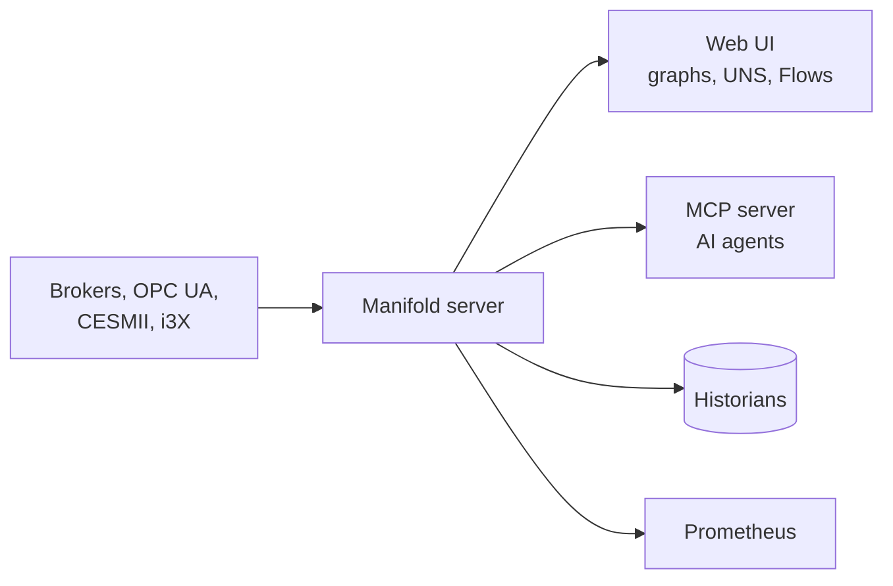

# 🏭 Manifold

**One live map of your industrial data** — MQTT · Sparkplug B · OPC UA · CESMII SMIP · i3X, explored, unified, and shaped into a Unified Namespace.

  

> *The live ISA-95 topology — built entirely from observed traffic: values on leaves, message rates on branches, publishing edges animated.*

---

## 🚀 Start here

| | Guide | You will learn |
|---|---|---|
| 🏁 | **[Getting Started](Getting-Started)** | Install, run, and connect your first broker in five minutes |
| 🔌 | **[Broker Setup](Broker-Setup)** | Intake QoS, the EMQX ACL recipe, admin APIs for consumer lineage |
| 🗄️ | **[Historians](Historians)** | InfluxDB, TimescaleDB, Timebase, TimeBase CE — with store-and-forward |
| 🔀 | **[Pipelines and Models](Pipelines-and-Models)** | Route, reshape, and contextualize the live stream |
| 🏷️ | **[Tags and Sparkplug](Tags-and-Sparkplug)** | Browse device tags and publish them into the UNS |
| 🛡️ | **[Operations](Operations)** | Auth, audit, Prometheus, config as code, alerts |
| 🩺 | **[Troubleshooting](Troubleshooting)** | Symptom → cause → fix |

## 📐 How it fits together

Deep design documentation lives in the repository:

- 📖 [README](https://github.com/zbest1000/manifold#readme) — overview and quick start
- 🏗️ [ARCHITECTURE.md](https://github.com/zbest1000/manifold/blob/main/ARCHITECTURE.md) — system design, hot path, API surface, testing
- 🐳 [DOCKER.md](https://github.com/zbest1000/manifold/blob/main/DOCKER.md) — one-command demo stack

---

> ✏️ These pages are generated from [`docs/wiki/`](https://github.com/zbest1000/manifold/tree/main/docs/wiki) in the repository and published by CI. **Edit there, not here** — direct wiki edits are overwritten by the next sync.
