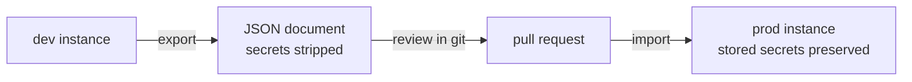

# 🛡️ Operations

> **Goal:** run Manifold like the control plane it is — authenticated,
> audited, monitored, and with its configuration in git.

## At a glance

The Overview page surfaces platform health live — pipelines, historians
(store-and-forward state), tag bindings, and alerts, each card linking to its
module:


> *Pipelines, historians, tag bindings, and alerts — live, each card linking to its module.*

For deeper self-observability, **System → Health** renders Manifold's own
Prometheus `/metrics` in the browser: process uptime, memory, and event-loop
delay; per-broker message rate and topic counts; and every engine counter
(pipelines, outbox, contracts, alerts, bindings, recorder) — each with a rolling
sparkline, and thresholds (event-loop delay, dropped/spilled points, errors)
flagged amber.

## Authentication and roles

Manifold can publish to brokers, actuate equipment through Sparkplug
commands, and scan networks. Run it authenticated anywhere beyond localhost:

```bash
MANIFOLD_AUTH_TOKEN=$(openssl rand -hex 24) \
MANIFOLD_VIEWER_TOKEN=$(openssl rand -hex 24) \
npm start
```

| Role | Token | Can |
|---|---|---|
| 🔑 Admin | `MANIFOLD_AUTH_TOKEN` | everything — API, socket, mutations |
| 👁️ Viewer | `MANIFOLD_VIEWER_TOKEN` | read everything; every mutation refused with 403 |

Auth is enforced identically on the REST API **and** the Socket.IO handshake —
the socket can publish and actuate, so it is gated the same way. Viewers see a
persistent *read-only* badge in the UI and mutation controls are disabled, so a
read-only session is never a wall of silent 403s. `/health` and `/metrics` stay
open for probes and scrapers.

### Fail closed by default

With **no token set**, the server binds `127.0.0.1` only and warns at startup —
an accidentally-unauthenticated instance is reachable from its own host, never
the network. Exposing an open instance off-host is a deliberate act:

```bash
MANIFOLD_HOST=0.0.0.0 npm start   # UNAUTHENTICATED and on the network — you were warned
```

The Docker demo already does this safely: it binds `0.0.0.0` inside the
container but maps only to host loopback (`127.0.0.1:5000:5000`), so `docker
compose up` is reachable at `localhost` and nowhere else until you set a token.

### Named tokens

For teams, `MANIFOLD_TOKENS` issues **individually revocable** tokens with a
name and a role — the name is what shows up in the audit trail:

```bash
MANIFOLD_TOKENS="alice:$(openssl rand -hex 24):admin,dashboard:$(openssl rand -hex 24):viewer" npm start
```

Format: `name:token:role,...` with role `admin` or `viewer`. Revoking one
person's access means removing one entry — no shared-secret rotation.

### Brute-force protection and rate limiting

Failed authentication is rate-limited per IP — on **both** the REST API and the
socket handshake — after **20 failures in a minute**, further attempts get `429`
until the window passes. Successful requests are unaffected. A separate general
limiter caps overall `/api` traffic (default 600 requests/minute per IP;
`MANIFOLD_RATE_MAX` / `MANIFOLD_RATE_WINDOW_MS`), and `helmet` sets standard
security headers on every response.

### Network safety (egress guard)

The two features that reach out to other machines — the CIDR network scanner and
the outbound HTTP clients (i3X, CESMII, broker admin APIs) — pass every target
through one egress guard. Loopback, link-local (including the cloud-metadata
address `169.254.169.254`), multicast, and reserved ranges are **always**
blocked, so Manifold can't be turned into an SSRF pivot or an internal port
scanner. RFC1918 / LAN targets — the normal case on a plant network, and what
Discovery is *for* — are **fail-closed by default**; set
`MANIFOLD_ALLOW_PRIVATE_TARGETS=1` on a trusted on-prem network to allow them
(the server warns at startup when it's on). The Docker demo sets it, since it is
a local-only demo.

### CORS

The API only accepts browser requests from `CLIENT_URL` (default
`http://localhost:3000`). Set it to the origin your users actually load the
UI from when the client is served separately.

## Audit log

Every mutating API call and socket command is recorded — role, IP, route,
outcome — with secrets redacted. View under **Settings → Audit** (admin
only), or read the append-only JSONL in `MANIFOLD_DATA_DIR`.

## Prometheus

`GET /metrics` exposes event-loop delay percentiles, per-broker ingest,
per-route pipeline counters, outbox depth/spill/drops, contract violations,
and binding publishes:

```yaml
scrape_configs:
  - job_name: manifold
    static_configs:
      - targets: ['manifold-host:5000']
```

> 💡 The Overview cards never poll — engine numbers are pushed over the existing
> socket every 2 s, only while a client is connected. The **System → Health**
> page reads the same `/metrics` endpoint directly for the full set (process and
> per-broker readings the socket stream doesn't carry).

## Configuration as code



**Settings → Config** exports the entire DataOps setup — pipelines, models,
historians, recordings, contracts, bindings, mounts, alert rules — as one
JSON document with secrets stripped. Import merges by id and keeps stored
secrets when the incoming document omits them.

## Alerts

Four rule types, evaluated server-side:

| Rule | Fires when | Evaluated |
|---|---|---|
| 📉 Branch silent | nothing under a path for N seconds | every 15 s |
| 🔇 Topic silent | a specific topic stops | every 15 s |
| 🆕 New topic | a topic appears (optionally under a prefix) | every 15 s |
| 📈 Value threshold | a numeric value crosses a limit | **per message**, as it arrives |

Value-threshold rules watch a topic's payload — or a dot-path `field` inside
a JSON payload (`motor.temp`) — against `>`, `>=`, `<`, `<=`, `==`, `!=`,
with two anti-flap controls:

- **Sustain** — the condition must hold continuously for `sustainMs` before
  the rule fires (one spiky sample is not an incident).
- **Clear value** — hysteresis: a `> 90` rule with clear value `85` fires at
  90 but only resolves back below 85, so a signal hovering at the threshold
  cannot flap.

Rules fire on transitions (firing → resolved) and can POST each event to a
webhook (5 s timeout). Webhook delivery failures are counted and the last
error is shown with the rules — a dead webhook is visible, not silent. Recent
events show in **Settings → Alerts** and stream over the socket.

## Data directory

`MANIFOLD_DATA_DIR` (default `server/data/`) holds profiles, history
snapshots, outbox spill, recordings, the audit log, and the OPC UA PKI
(`pki/` — Manifold's application certificate and the trusted/rejected server
certificate stores) — written 0600/0700.

> ⚠️ The profiles file contains connection credentials, and `pki/own/private`
> holds the OPC UA private key. Protect the host, and back the directory up
> if your DataOps config matters. If the profiles file is ever corrupted, it
> is backed up to `profiles.json.bak` before the server starts clean —
> credentials are recoverable.

## Docker image

Every `v*` tag publishes `ghcr.io/zbest1000/manifold` — server plus built UI
in one container:

```bash
docker run -p 5000:5000 \
  -v manifold-data:/data \
  -e MANIFOLD_AUTH_TOKEN=... \
  ghcr.io/zbest1000/manifold:latest
```

The image sets `MANIFOLD_DATA_DIR=/data` — mount a volume there or your
profiles, history, spill files, and PKI vanish with the container. `/health`
answers without a token, so it works as a liveness probe even when auth is
on.
