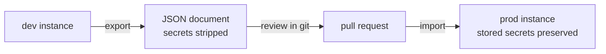

# 🛡️ Operations

> **Goal:** run Manifold like the control plane it is — authenticated,
> audited, monitored, and with its configuration in git.

## At a glance

The Overview page surfaces platform health live — pipelines, historians
(store-and-forward state), tag bindings, and alerts, each card linking to its
module:


> *Pipelines, historians, tag bindings, and alerts — live, each card linking to its module.*

## Authentication and roles

Manifold can publish to brokers, actuate equipment through Sparkplug
commands, and scan networks. Run it authenticated anywhere beyond localhost:

```bash
MANIFOLD_AUTH_TOKEN=$(openssl rand -hex 24) \
MANIFOLD_VIEWER_TOKEN=$(openssl rand -hex 24) \
npm start
```

| Role | Token | Can |
|---|---|---|
| 🔑 Admin | `MANIFOLD_AUTH_TOKEN` | everything — API, socket, mutations |
| 👁️ Viewer | `MANIFOLD_VIEWER_TOKEN` | read everything; every mutation refused with 403 |

`/health` stays open for liveness probes. Without tokens the server runs open
and warns loudly at startup.

## Audit log

Every mutating API call and socket command is recorded — role, IP, route,
outcome — with secrets redacted. View under **Settings → Audit** (admin
only), or read the append-only JSONL in `MANIFOLD_DATA_DIR`.

## Prometheus

`GET /metrics` exposes event-loop delay percentiles, per-broker ingest,
per-route pipeline counters, outbox depth/spill/drops, contract violations,
and binding publishes:

```yaml
scrape_configs:
  - job_name: manifold
    static_configs:
      - targets: ['manifold-host:5000']
```

> 💡 The web UI never polls for these numbers — they're pushed over the
> existing socket every 2 s, and only while a client is connected.

## Configuration as code



**Settings → Config** exports the entire DataOps setup — pipelines, models,
historians, recordings, contracts, bindings, mounts, alert rules — as one
JSON document with secrets stripped. Import merges by id and keeps stored
secrets when the incoming document omits them.

## Alerts

Three rule types, evaluated server-side every 15 s against the same index the
UI reads:

| Rule | Fires when |
|---|---|
| 📉 Branch silent | nothing under a path for N seconds |
| 🔇 Topic silent | a specific topic stops |
| 🆕 New topic | a topic appears (optionally under a prefix) |

Rules fire on transitions (firing → resolved) and can POST each event to a
webhook. Recent events show in **Settings → Alerts** and stream over the
socket.

## Data directory

`MANIFOLD_DATA_DIR` (default `server/data/`) holds profiles, history
snapshots, outbox spill, recordings, and the audit log — written 0600/0700.

> ⚠️ The profiles file contains connection credentials. Protect the host, and
> back the directory up if your DataOps config matters.
