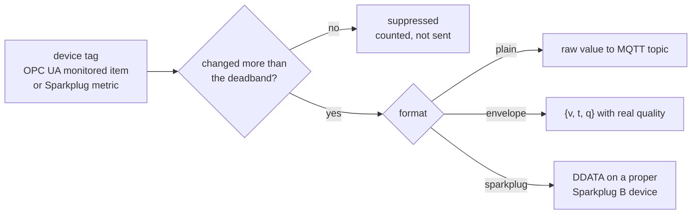
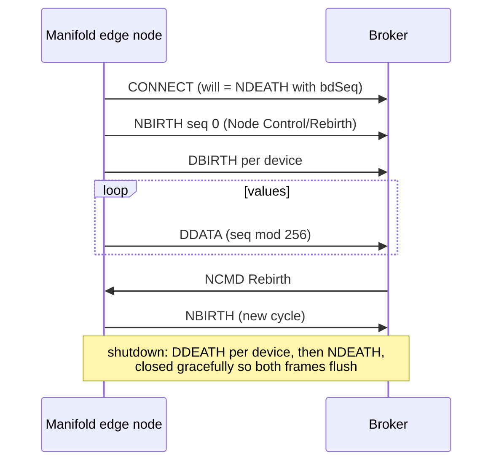

# 🏷️ Tags and Sparkplug

> **Goal:** from "browse a device's tags" to "they live in the UNS" in one
> wizard — with report-by-exception and real quality codes on the way.

## The tag browser

**Tags** unifies every source Manifold already speaks:

| Source | What you browse |
|---|---|
| 🖧 OPC UA | the address space of any connected server, loaded lazily |
| ⚡ Sparkplug | the device registry (Group → Edge → Device → metrics) rebuilt from BIRTH certificates |
| 📡 MQTT | the observed topic trie |

Tick tags, hit **Add to UNS**, and the wizard does the right thing per
source: MQTT selections compile into a pipeline route; OPC UA and Sparkplug
selections become **bindings**.

## How a binding flows



- **Report by exception** — an absolute deadband suppresses numeric noise;
  non-numeric values publish on change only.
- **Quality is honest** — OPC UA status codes map to Good 192 / Uncertain 64 /
  Bad 0 and travel inside the envelope.
- **Read-only by design** — bindings never write toward a device. There is no
  write path in the engine.

## CSV import

Tag exports from Kepware/Ignition-style tools drop straight into the
selection:

```csv
nodeId,name
ns=2;s=Channel1.Device1.Temperature,Temperature
ns=2;s=Channel1.Device1.Pressure,Pressure
```

## The Sparkplug B publisher

Bindings that target Sparkplug get a dedicated session per (broker, group,
edge node) implementing the specification's full lifecycle — consumers with
Sparkplug state management (Ignition, HiveMQ extensions, Timebase collectors)
see Manifold as a first-class edge node:



> ✅ This lifecycle is exercised frame-by-frame against a real broker in CI —
> BIRTH ordering, sequence numbering, and death certificates included.

## Host application STATE

Sparkplug host applications announce themselves on retained
`spBv1.0/STATE/{host_id}` topics. Manifold works with STATE in both
directions:

- **Tracking** — every STATE message folds into the registry: host
  online/offline status appears in the Tags page and in the UNS event feed
  (`host-online` / `host-offline`). Because STATE is retained, status is
  correct immediately after connecting.
- **Publishing** — the *Primary host STATE* panel on the Tags page starts a
  dedicated session that publishes retained `{ "online": true, ... }` for a
  host ID of your choice, with a matching last-will. Edge nodes configured to
  wait for a primary host (a common Ignition/edge gateway setting) then see
  one and start publishing.

> 💡 Only run one primary host per host ID on a broker — that is the
> specification's whole point. Manifold refuses nothing here; the convention
> is yours to keep.
