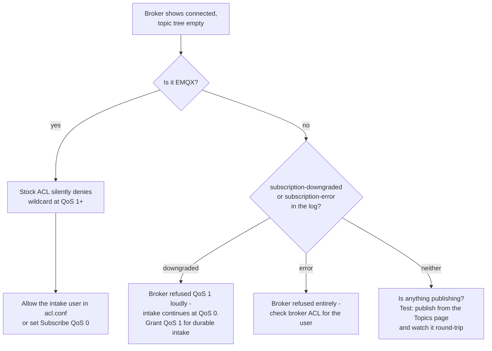

# 🩺 Troubleshooting

> Start with the decision tree for the most common case — "I connected but
> see nothing" — then use the symptom table.

## No data appearing?

## Symptom table

| Symptom | Likely cause | Fix |
|---|---|---|
| 🔌 Broker *connected* but no topics (EMQX) | Stock EMQX silently denies `#` at QoS 1+ (`deny_action=ignore`) | Broker ACL allow rule, or *Subscribe QoS* 0 — see [Broker Setup](Broker-Setup) |
| 🔉 `subscription-downgraded` events | Broker refused the wildcard grant loudly (SUBACK 0x80); Manifold fell back to QoS 0 | Expected. Grant QoS 1 in the broker ACL for durable intake |
| 💾 Historian spill bytes growing | Historian unreachable or rejecting writes; points spilling to disk | Check `lastError` on the card, fix connectivity/auth — spill drains oldest-first automatically |
| ⏱️ TimescaleDB write errors with a timeout | Database unreachable — connections have bounded timeouts by design | Fix connectivity; queued points spill and recover |
| 👥 Flows → Consumers empty | No broker admin API configured, or broker is Mosquitto (no per-client subscription API) | Configure EMQX/HiveMQ admin credentials; for Mosquitto this data does not exist |
| 🔢 Influx rejects writes: field type conflict | Another writer created the field with a different type in the current shard | Manifold's `value=`/`raw=` split can't cause this — check other writers, or use a fresh bucket |
| 🕰️ UNS marks a slow topic *dead* | The topic hasn't established its publish cadence yet | Staleness is per-topic (inter-arrival EMA); thresholds adapt after a few publishes |
| ⚡ Sparkplug devices offline after a broker restart | Edge nodes haven't re-birthed | State comes from BIRTH certificates (per spec); send an NCMD rebirth or wait for reconnect BIRTH |
| 🧪 Tests fail: "Unable to deserialize cloned data" | `node --test` child-process IPC corruption | Use `npm test` (serial in-process runner). Harness-only issue, never the server |
| 🔒 Unlock screen appears unexpectedly | `MANIFOLD_AUTH_TOKEN` is set on the server | Enter the token (remembered locally). Viewer tokens get read-only access |
| 🚫 API answers `429` | Auth-failure rate limit — 20 bad tokens per minute from one IP | Fix the token; the window clears after a minute |
| 🔐 OPC UA secure connect fails: certificate not trusted | The server's certificate is unknown (it lands in `rejected/`) — or the server rejected *Manifold's* certificate | Trust the server certificate (trust panel / `POST /api/opcua/trust`, or reconnect with trust-on-first-connect); for the reverse case, install Manifold's certificate (`GET /api/opcua/certificate`) on the server |
| 📡 "Disconnected" banner across the top of the UI | The socket to the backend dropped — panels would otherwise show stale data silently | Check that the server is up and reachable; the banner clears on reconnect |

## Still stuck?

- The audit log (**Settings → Audit**) shows every mutation and its outcome.
- `/metrics` exposes counters for most engines — a zero where you expect
  traffic points at the failing stage.
- [Open an issue](https://github.com/zbest1000/manifold/issues) with the
  symptom, broker type, and any `subscription-*` events from the log.
